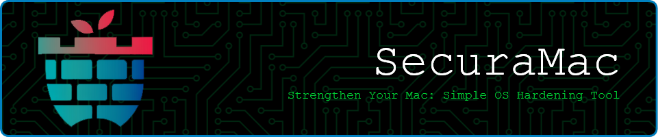

`SecuraMac` simplifies macOS security, offering quick and effective tools to fortify your system and ensure protection.


**Installation Options**
---


### How to Run Script

#### 1. Using `curl`
You can use `curl` to fetch the raw Zsh script from GitHub and execute it immediately with sudo:

```bash
sudo zsh <(curl -s https://raw.githubusercontent.com/cocopuff2u/SecuraMac/main/SecuraMac.zsh)
```

**Configuration Options**
---

### 1. Update Rules (Enable/Disable)
Maintaining up-to-date software is crucial for security. Enabling these settings ensures that your macOS system and applications automatically check for, download, and install important updates and patches, thereby reducing vulnerabilities and enhancing overall system integrity.

- **Enable Automatic Update Check?**
  Regular checks keep your system secure by applying essential updates.

- **Enable Automatic Update Download?**
  Allows critical updates to be downloaded automatically, minimizing security risks.

- **Enable Critical Update Install?**
  Automatically installs vital updates, protecting against vulnerabilities.

- **Enable Configuration Data Install?**
  Automatically updates configuration data to maintain system security.

- **Enable Automatic App Update?**
  Ensures apps receive timely security updates, reducing exploit risks.

### 2. Firewall Rules (Enable/Disable)
Configuring firewall settings is a key defense mechanism to protect your Mac from unauthorized access and potential attacks from external sources. These rules enhance security by monitoring incoming and outgoing network traffic.

- **Turn on Firewall?**
  This helps protect your Mac from being attacked over the internet.

- **Turn on stealth mode?**
  Your Mac will not respond to ICMP ping requests or connection attempts from closed TCP and UDP networks.

### 3. Logging Rules (Enable)
Implementing logging rules enhances security monitoring by tracking various activities and events. These rules ensure that critical actions are recorded and that sensitive data remains protected.

- **Set Audit Log Files To Not Contain Access Control List?**
  Access control lists will no longer be included in the log files.

- **Set Audit Log Folders To Not Contain Access Control List?**
  Access control lists will no longer be included in the log folders.

- **Audit All Administrative Action Events?**
  Administrative action events will now be audited for all activities.

- **Audit All Log On Log Out?**
  Audits all log on and log out actions in the audit log.

- **Enable_Security_Auditing?**
  This rule checks if the security auditing service is running and if the audit control file exists.

- **Configure System To Shutdown Upon Audit Failure?**
  This rule ensures that the system is configured to shut down automatically if an audit failure occurs.

- **Set Audit Log Files To Be Owned By Root?**
  This rule checks that all audit log files are owned by the root user.

- **Set Audit Log Folders To Be Owned By Root?**
  This rule checks that all audit log folders are owned by the root user.

- **Set Audit Log Files To Be Group Owned By Wheel?**
  This rule ensures that audit log files are group-owned by the wheel group.

- **Set Audit Log Folders To Be Group Owned By Wheel?**
  This rule checks that all audit log folders are group-owned by the wheel group.

- **Set Audit Log Files Mode 440 or Less Permissive?**
  This rule checks that audit log files have permissions set to 440 or less permissive.

- **Set Audit Log Folder Mode 700 or Less Permissive?**
  This rule checks that audit log folders have permissions set to 700 or less permissive.

- **Set To Audit All Deletion Of Object Attributes?**
  This rule ensures that deletion of object attributes is audited.

- **Audit All Changes Of Object Attributes?**
  This rule ensures that changes to object attributes are audited.

- **Audit All Failed Read Actions?**
  This rule ensures that all failed read actions are audited.

- **Audit All Failed Write Actions?**
  This rule ensures that all failed write actions are audited.

- **Audit All Failed Program Executions?**
  This rule ensures that all failed program executions are audited.

- **Audit Retention Set To 7 Days?**
  This rule ensures that audit log retention is set to 7 days.

- **Audit Capacity Warning?**
  This rule checks that a minimum free space of 25% is set for audit logs.

- **Audit Failure Notification?**
  This rule ensures that audit failures are logged with a notification.

- **Audit All Authorization Authentication Events?**
  This rule checks if all authorization and authentication events are being audited.

- **Configure Audit Control Group To Wheel?**
  This rule ensures that the audit control file group is set to wheel.

- **Configure Audit Control Owner To Root?**
  This rule ensures that the audit control file is owned by root.

- **Configure Audit Control To Mode 440 or Less Permissive?**
  This rule ensures that the audit control file has permissions set to 440 or less permissive.

- **Configure Audit Control To Not Contain Access Control Lists?**
  This rule ensures that the audit control file does not contain access control lists.

- **Configure Apple System Log Files To Be Owned By Root and Group To Wheel?**
  This rule ensures that Apple system log files are owned by root and the group is set to wheel.

- **Configure Apple System Log Files To Mode 640 Or Less Permissive?**
  This rule ensures that Apple system log files have permissions set to 640 or less permissive.

- **Configure System Log Files To Be Owned By Root and Group To Wheel?**
  This rule ensures that system log files are owned by root and the group is set to wheel.

- **Configure System Log Files To Mode 640 Or Less Permissive?**
  This rule ensures that system log files have permissions set to 640 or less permissive.

- **System Log Retention To 365 Days?**
  This rule ensures that system log retention is set to 365 days.

- **Configure Sudoers Timestamp Type?**
  This rule ensures that the sudoers timestamp type is set correctly.

### 4. System Utility Rules (Enable/Disable)
Disabling unnecessary services and features enhances privacy and security by reducing potential attack vectors. These rules ensure that sensitive functionalities are controlled and monitored.

- **Disable Spotlight Indexing?**
  Disabling Spotlight indexing prevents macOS from scanning and cataloging files, which enhances privacy by reducing system metadata exposure.

- **Disable Metadata Write on External Drives?**
  Disabling metadata writing prevents macOS from writing metadata (e.g., file history) on external drives, protecting sensitive information.

- **Disable Server Message Block Sharing?**
  Disabling the SMB sharing service helps secure your system by preventing unauthorized access to shared files over the network.

- **Disable Network File System Service?**
  Disabling NFS prevents unauthorized file access and sharing over the network, improving system security.

- **Disable Location Services?**
  Disabling Location Services protects user privacy by preventing apps from accessing location data.

- **Disable Unix to Unix Copy Protocol Service?**
  Disabling UUCP prevents potential exploitation of outdated communication protocols, securing the system.

- **Disable Built-In Web Server?**
  Disabling the built-in web server (Apache) secures your system by preventing unauthorized web service access.

- **Disable Remote Apple Events?**
  Disabling Remote Apple Events prevents remote control of your system, increasing overall security.

- **Disable Trivial File Transfer Protocol Service?**
  Disabling TFTP protects your system from unauthorized file transfers, enhancing security.

- **Disable Bluetooth Sharing?**
  Disabling Bluetooth Sharing ensures that files are not shared over Bluetooth, protecting sensitive data.

- **Disable CD/DVD Sharing?**
  Disabling CD/DVD Sharing prevents unauthorized access to media drives, securing your system.

- **Disable Printer Sharing?**
  Disabling Printer Sharing ensures that printers are not accessible over the network, protecting sensitive data.

- **Disable Remote Management?**
  Disabling Remote Management prevents unauthorized control of your system, enhancing security.