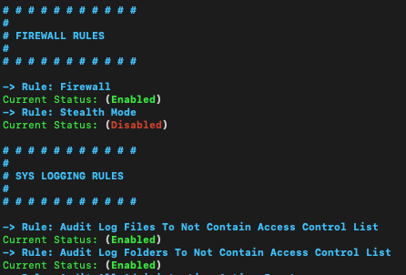

## How to Run SecuraMac

### Overview

`SecuraMac` is a security enhancement tool designed for macOS, providing a streamlined way to fortify your system's defenses against vulnerabilities and threats. This guide will help you install and run `SecuraMac` easily.

<p align="center">
  
</p>

**Compatibility**: `SecuraMac` is designed/tested for macOS Sequoia and Sonoma. While some rules might function on earlier versions, full compatibility isn't guaranteed.

### Installation Options

#### Method 1: Using `curl` (Recommended)

This method allows you to quickly fetch and execute the script in one command. Ensure you have administrative privileges (sudo access) before proceeding.

1. **Open Terminal**: 
   - You can find the Terminal application in `Applications > Utilities > Terminal` or by using Spotlight (press `Cmd + Space`, type "Terminal," and hit Enter).

2. **Run the Command**: 
   - Copy and paste the following command into the Terminal and press Enter:
   ```bash
   sudo zsh -c "$(curl -s https://raw.githubusercontent.com/cocopuff2u/SecuraMac/main/SecuraMac.zsh)"
   ```
   - You will be prompted to enter your password. Type your password (note that it won’t be displayed) and hit Enter.

3. **Follow On-Screen Instructions**: 
   - The script will provide guidance on what actions it is taking and any further configurations you may need to consider.

#### Method 2: Manual Download and Execution

1. **Download the Script**:
   - Go to [SecuraMac GitHub](https://github.com/cocopuff2u/SecuraMac) and download `SecuraMac.zsh`.

2. **Open Terminal**:
   - Find Terminal in `Applications > Utilities > Terminal`.

3. **Navigate to the Download Location**:
   ```bash
   cd ~/Downloads
   ```

4. **Make the Script Executable**:
   ```bash
   chmod +x SecuraMac.zsh
   ```

5. **Run the Script with Sudo**:
   ```bash
   sudo ./SecuraMac.zsh
   ```

6. **Follow On-Screen Instructions**.

### Skipping Warnings and Hiding Descriptions

To customize your experience when running the script, you can use the following flags:

- **Skip Warnings**: Add `/y` before the script command to skip any warning messages.
  
- **Hide Descriptions**: Add `/h` before the script command to hide detailed descriptions of actions being taken.

For example, you can run:
```bash
sudo zsh -c "$(curl -s https://raw.githubusercontent.com/cocopuff2u/SecuraMac/main/SecuraMac.zsh)" /y /h
```

### Important Notes

- **Backup Your Data**: Always back up your important data before running security scripts. This precaution helps safeguard against unintended consequences.

- **Review Changes**: After running `SecuraMac`, review any changes made to your system settings. Familiarize yourself with the alterations to understand their impact on your system's operation.

**Logging Options**
---

These options produce the current results of the system without making any changes.

- **Display results in the terminal only?**  
  Shows system results directly in the terminal.

- **Display results in the terminal and export to CSV?**  
  Shows system results in terminal and saves them to a CSV file.

- **Display results in the terminal, export to CSV, and Plist?**  
  Shows system results in terminal and saves them to both CSV and plist files.

  

**Configuration Options**
---

### 1. Update Rules (Enable/Disable)

Maintaining up-to-date software is crucial for security. Enabling these settings ensures that your macOS system and applications automatically check for, download, and install important updates and patches, thereby reducing vulnerabilities and enhancing overall system integrity.

- **Enable Automatic Update Check?**  
  Regular checks keep your system secure by applying essential updates.

- **Enable Automatic Update Download?**  
  Allows critical updates to be downloaded automatically, minimizing security risks.

- **Enable Critical Update Install?**  
  Automatically installs vital updates, protecting against vulnerabilities.

- **Enable Configuration Data Install?**  
  Automatically updates configuration data to maintain system security.

- **Enable Automatic App Update?**  
  Ensures apps receive timely security updates, reducing exploit risks.

### 2. User Preference Rules (Enable/Disable)

Enforcing these settings enhances security by protecting sensitive data, preventing unauthorized access, and ensuring user accountability on the operating system.

- **Lock Mac as Soon as Screensaver Starts?**  
  If your screen is black or on screensaver mode, you'll be prompted for a password to login every time.

- **Display All File Extensions?**  
  This prevents malware from disguising itself as another file type.

- **Display Hidden Files in Finder?**  
  This lets you see all files on the system without having to use the terminal.

- **Disable Saving to the Cloud by Default?**  
  This prevents sensitive documents from being unintentionally stored on the cloud.

- **Prevent Access to Other User's Home Folder's?**  
  The default behavior of macOS is to allow all valid users access to the top level of every other user's home folder while restricting access only to the Apple default folders within.

- **System Must Reauthenticate For Privilege Escalations When Using Sudo Command?**  
  Password hints leak information about passwords that are currently in use and can lead to loss of confidentiality.

### 3. Firewall Rules (Enable/Disable)

Configuring firewall settings is a key defense mechanism to protect your Mac from unauthorized access and potential attacks from external sources. These rules enhance security by monitoring incoming and outgoing network traffic.

- **Turn on Firewall?**  
  This helps protect your Mac from being attacked over the internet.

- **Turn on stealth mode?**  
  Your Mac will not respond to ICMP ping requests or connection attempts from closed TCP and UDP networks.

### 4. Logging Rules (Enable)

Implementing logging rules enhances security monitoring by tracking various activities and events. These rules ensure that critical actions are recorded and that sensitive data remains protected.

- **Set Audit Log Files To Not Contain Access Control List?**  
  Access control lists will no longer be included in the log files.

- **Set Audit Log Folders To Not Contain Access Control List?**  
  Access control lists will no longer be included in the log folders.

- **Audit All Administrative Action Events?**  
  Administrative action events will now be audited for all activities.

- **Audit All Log On Log Out?**  
  Audits all log on and log out actions in the audit log.

- **Enable Security Auditing?**  
  This rule checks if the security auditing service is running and if the audit control file exists.

- **Configure System To Shutdown Upon Audit Failure?**  
  This rule ensures that the system is configured to shut down automatically if an audit failure occurs.

- **Set Audit Log Files To Be Owned By Root?**  
  This rule checks that all audit log files are owned by the root user.

- **Set Audit Log Folders To Be Owned By Root?**  
  This rule checks that all audit log folders are owned by the root user.

- **Set Audit Log Files To Be Group Owned By Wheel?**  
  This rule ensures that audit log files are group-owned by the wheel group.

- **Set Audit Log Folders To Be Group Owned By Wheel?**  
  This rule checks that all audit log folders are group-owned by the wheel group.

- **Set Audit Log Files Mode 440 or Less Permissive?**  
  This rule checks that audit log files have permissions set to 440 or less permissive.

- **Set Audit Log Folder Mode 700 or Less Permissive?**  
  This rule checks that audit log folders have permissions set to 700 or less permissive.

- **Set To Audit All Deletion Of Object Attributes?**  
  This rule ensures that deletion of object attributes is audited.

- **Audit All Changes Of Object Attributes?**  
  This rule ensures that changes to object attributes are audited.

- **Audit All Failed Read Actions?**  
  This rule ensures that all failed read actions are audited.

- **Audit All Failed Write Actions?**  
  This rule ensures that all failed write actions are audited.

- **Audit All Failed Program Executions?**  
  This rule ensures that all failed program executions are audited.

- **Audit Retention Set To 7 Days?**  
  This rule ensures that audit log retention is set to 7 days.

- **Audit Capacity Warning?**  
  This rule checks that a minimum free space of 25% is set for audit logs.

- **Audit Failure Notification?**  
  This rule ensures that audit failures are logged with a notification.

- **Audit All Authorization Authentication Events?**  
  This rule checks if all authorization and authentication events are being audited.

- **Configure Audit Control Group To Wheel?**  
  This rule ensures that the audit control file group is set to wheel.

- **Configure Audit Control Owner To Root?**  
  This rule ensures that the audit control file is owned by root.

- **Configure Audit Control To Mode 440 or Less Permissive?**  
  This rule ensures that the audit control file has permissions set to 440 or less permissive.

- **Configure Audit Control To Not Contain Access Control Lists?**  
  This rule ensures that the audit control file does not contain access control lists.

- **Configure Apple System Log Files To Be Owned By Root and Group To Wheel?**  
  This rule ensures that Apple system log files are owned by root and the group is set to wheel.

- **Configure Apple System Log Files To Mode 640 Or Less Permissive?**  
  This rule ensures that Apple system log files have permissions set to 640 or less permissive.

- **Configure System Log Files To Be Owned By Root and Group To Wheel?**  
  This rule ensures that system log files are owned by root and the group is set to wheel.

- **Configure System Log Files To Mode 640 Or Less Permissive?**  
  This rule ensures that system log files have permissions set to 640 or less permissive.

- **System Log Retention To 365 Days?**  
  This rule ensures that system log retention is set to 365 days.

- **Configure Sudoers Timestamp Type?**  
  This rule ensures that the sudoers timestamp type is set correctly.

### 5. System Utility Rules (Enable/Disable)

Disabling unnecessary services and features enhances privacy and security by reducing potential attack vectors. These rules ensure that sensitive functionalities are controlled and monitored.

- **Disable Spotlight Indexing?**  
  Disabling Spotlight indexing prevents macOS from scanning and cataloging files, which enhances privacy by reducing system metadata exposure.

- **Disable Metadata Write on External Drives?**  
  Disabling metadata writing prevents macOS from writing metadata (e.g., file history) on external drives, protecting sensitive information.

- **Disable Server Message Block Sharing?**  
  Disabling the SMB sharing service helps secure your system by preventing unauthorized access to shared files over the network.

- **Disable Network File System Service?**  
  Disabling NFS prevents unauthorized file access and sharing over the network, improving system security.

- **Disable Location Services?**  
  Disabling Location Services protects user privacy by preventing apps from accessing location data.

- **Disable Unix to Unix Copy Protocol Service?**  
  Disabling UUCP prevents potential exploitation of outdated communication protocols, securing the system.

- **Disable Built-In Web Server?**  
  Disabling the built-in web server (Apache) secures your system by preventing unauthorized web service access.

- **Disable Remote Apple Events?**  
  Disabling Remote Apple Events prevents remote control of your system, increasing overall security.

- **Disable Trivial File Transfer Protocol Service?**  
  Disabling TFTP protects your system from unauthorized file transfers, enhancing security.

- **Disable Bluetooth Sharing?**  
  Disabling Bluetooth Sharing ensures that files are not shared over Bluetooth, protecting sensitive data.

- **Disable CD/DVD Sharing?**  
  Disabling CD/DVD Sharing prevents unauthorized access to media drives, securing your system.

- **Disable Printer Sharing?**  
  Disabling Printer Sharing ensures that printers are not accessible over the network, protecting sensitive data.

- **Disable Remote Management?**  
  Disabling Remote Management prevents unauthorized control of your system, enhancing security.

**Clean Options**
---

Cleaning these data types enhances system performance and reliability, protects user privacy, and resolves issues caused by outdated or corrupted files, ensuring a smoother and more secure computing experience.

- **Clear QuickLook Metadata?**  
  Erasing Spotlight user data protects privacy by removing traces of recently accessed files, preventing unauthorized visibility into your activities.

- **Clear Downloads Metadata?**  
  Clearing downloads metadata reduces privacy risks by ensuring that sensitive download information is not stored and accessible.

- **Clear User Cache?**  
  Removing application cache data can improve system performance and free up disk space by eliminating corrupted or outdated files.

- **Clear System Cache?**  
  Clearing system-wide cache helps maintain optimal performance by ensuring the system relies on current data, resolving potential slowdowns.

- **Clear Application Support Cache?**  
  This action enhances app functionality and responsiveness by eliminating outdated cache data, allowing applications to rebuild necessary files.

- **Clear Font Cache?**  
  Clearing font cache can fix font rendering issues, ensuring that text displays correctly and enhancing visual consistency.

- **Clear Kernel Cache?**  
  Removing kernel extension cache data resolves compatibility and stability issues, improving overall system reliability.

- **Clear System Logs and Cache?**  
  This helps free up space and maintain performance by eliminating old logs and cache files, which also enhances security by reducing stored sensitive information.

---

### Contributing/Feedback to SecuraMac

We welcome contributions to SecuraMac! If you’d like to contribute or provide feedback:

- **Report Issues**: Submit an issue on our [GitHub Issues page](https://github.com/cocopuff2u/SecuraMac/issues) for bug reports or feature requests.
- **Join the Discussion**: Connect with me, cocopuff2u, on the [Mac Admins Slack Channel](https://join.slack.com/t/macadmins/shared_invite/zt-2o5811yhx-q5MNLrFG1VoHRusXLgZwsw) to discuss and collaborate.
- **Email**: Reach out directly at [cocopuff2u@yahoo.com](mailto:cocopuff2u@yahoo.com) for any inquiries.
- **Share Feedback**: We welcome your suggestions and comments to help us improve. Your feedback is crucial, so please feel free to share your thoughts!
- **Fork and Fix**: Want to contribute directly? Fork the repository, make your changes, and submit a pull request to help enhance the code.


### Acknowledgements

[@Darixn](https://github.com/darixn) - For help with the logo and content

[MacOS Security and Privacy Guide](https://github.com/drduh/macOS-Security-and-Privacy-Guide) - Helpful for building

[StrongHold](https://github.com/alichtman/stronghold) - Loved this idea and wanted to present a newer version of it


### Donations

This is free, open-source software. If you'd like to support the development of future projects, or buy me a coffee, you can donate to my venmo `cocopuff2u`.
